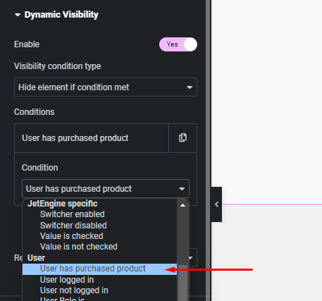

# woo-user-purchased-jetengine-visibility

This plugin allows to add an option for Jet Engines `Dynamic Visibility`.

### Preview : 

It dynamically manages sections based on whether the current user has purchased the product or not. This capability functions seamlessly in both dynamic loops and single-product templates.

# How to install 
- download the zip under the `/builds` folder
- Upload and install, its plug and play